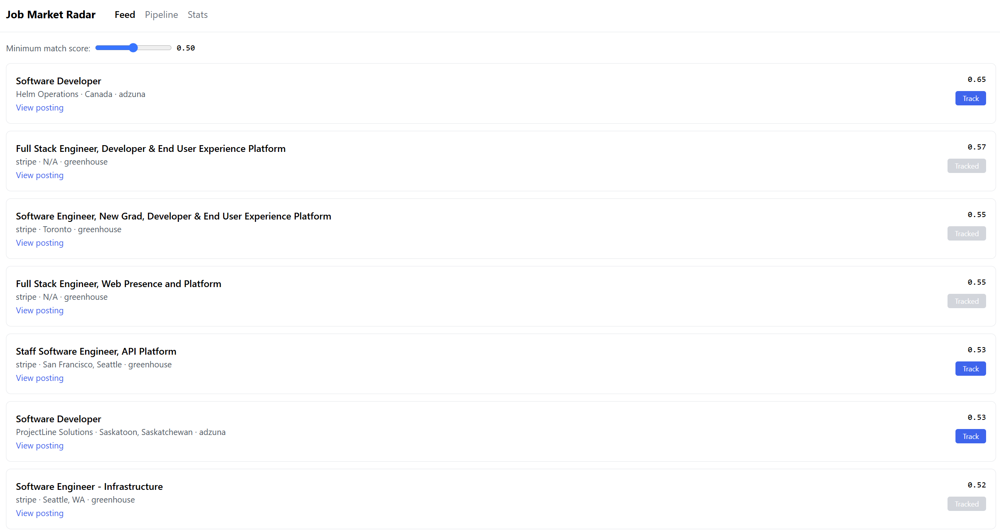
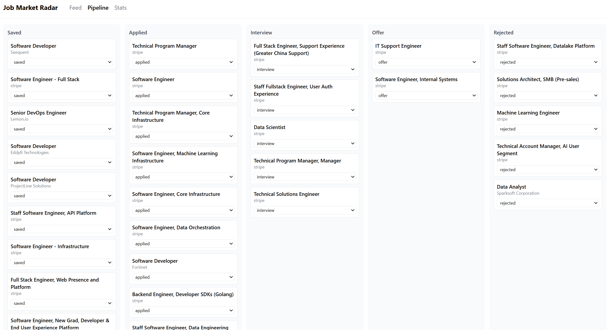
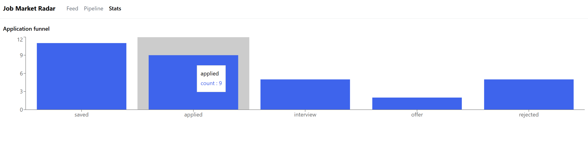

# Smart Job Market Radar & Application Tracker


A self-hosted system that monitors job board APIs on a schedule, scores each
posting against a candidate profile using semantic similarity, notifies on
strong matches, and tracks the resulting applications through a pipeline —
from discovery to offer.

**Live demo:** http://129.213.98.136:5173
**API docs:** http://129.213.98.136:8000/docs







## Why this exists

Checking multiple job boards by hand is slow, and a spreadsheet-based
application tracker doesn't tell you which postings are actually worth your
time. This automates the discovery and ranking step, and gives the tracking
step a real pipeline instead of a spreadsheet.

## Architecture

```
Scheduler (Celery beat) → Ingestion → PostgreSQL → Matcher → Notifier
                                          ↕
                                    Tracker API (FastAPI) ↔ React dashboard
```

- **Ingestion** pulls postings from Greenhouse, Lever, Adzuna, and RemoteOK
  on a schedule, normalized into a shared schema, deduplicated on
  `(source, external_id)`.
- **Matching** embeds each posting and a candidate profile with
  `sentence-transformers`, ranking by cosine similarity — semantic matching,
  not keyword overlap.
- **Notifications** fire to Discord when a posting crosses a configurable
  match-score threshold.
- **Tracker API** exposes postings and applications over REST, backed by
  PostgreSQL with Alembic-managed migrations.
- **Dashboard** (React) — a ranked feed, a kanban-style pipeline board, and
  an application funnel chart.

## Tech stack

Python, FastAPI, PostgreSQL, SQLAlchemy, Alembic, Celery, Redis,
sentence-transformers, React, Tailwind, Recharts, Docker, GitHub Actions,
pytest.

## Running it locally

```bash
git clone https://github.com/SanjayaM4/job-market-radar.git
cd job-market-radar
cp .env.example .env   # fill in API keys - see below
docker compose up -d --build
docker compose exec api alembic upgrade head
```
API: http://localhost:8000/docs · Dashboard: http://localhost:5173

### Getting API keys
- **Adzuna**: register at developer.adzuna.com — instant `app_id`/`app_key`.
- **Greenhouse / Lever / RemoteOK**: no key needed.
- **Discord notifications**: create a webhook in your server's
  Integrations settings, paste the URL into `.env`.

## Testing

```bash
pytest -v
```
Runs against an in-memory SQLite database — no external services required.
Covers the matching engine, ingestion normalization, and the API's core
request flows (create/list/update applications, duplicate-tracking
rejection).

## Deployment

Deployed on an Oracle Cloud Always Free Ampere A1 VM, running the full
Docker Compose stack (Postgres, Redis, API, Celery worker, Celery beat,
frontend) continuously. GitHub Actions runs the test suite and verifies
both Docker images build on every push to `main`.
